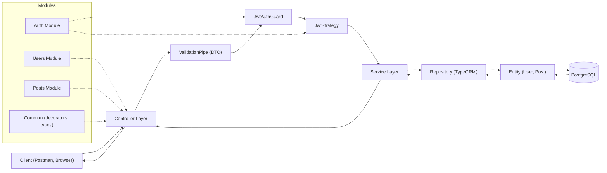

# NestJS REST API with JWT Authentication

A comprehensive REST API built with NestJS, TypeScript, PostgreSQL, and JWT Authentication featuring CRUD operations for Users and Posts with a modular architecture.

## 🏗️ Architecture Pattern: Modular Monolith with Repository Pattern

### Why This Pattern?

I use a **Modular Monolith Architecture** with a **Repository Pattern** for these reasons:

#### 1. **Modular Architecture**
- **Separation of Concerns**: Each module (Users, Posts, Auth) has a clear and isolated responsibility
- **Scalability**: Easy to add new modules or later extract into microservices
- **Maintainability**: Code is easier to understand, test, and maintain because each module stands alone
- **Team Collaboration**: Teams can work on different modules with fewer conflicts

#### 2. **Repository Pattern**
- **Abstraction**: Separates business logic from data access logic
- **Testability**: Easy to mock repositories for unit testing
- **Flexibility**: Easy to swap databases or ORM without changing business logic
- **Clean Code**: Cleaner code that follows SOLID principles

#### 3. **Dependency Injection**
- NestJS provides a powerful DI container
- Loose coupling between components
- Easier testing with mocked dependencies

#### 4. **Layered Architecture**
```
├── Controller Layer    (HTTP Request/Response handling)
├── Service Layer       (Business Logic)
├── Repository Layer    (Data Access via TypeORM)
└── Entity Layer        (Database Models)
```

## 🔁 General Flow (Request & Auth)

Request flow:
```
Client → Controller → Service → Repository (TypeORM) → PostgreSQL → Response
```

Authentication flow:
1. `POST /auth/login` → validate credentials → return JWT token.
2. Request with `Authorization: Bearer <token>` → `JwtAuthGuard` checks token.
3. `JwtStrategy` validates token and attaches `request.user`.
4. Controller uses `request.user` for protected actions.

## 🧭 Architecture Diagram



### Folder Structure
```
src/
├── auth/                 # Authentication module (JWT)
│   ├── auth.controller.ts
│   ├── auth.service.ts
│   ├── auth.module.ts
│   ├── dto/
│   │   └── login.dto.ts
│   ├── guards/
│   │   └── jwt-auth.guard.ts
│   └── strategies/
│       └── jwt.strategy.ts
├── users/               # Users module (CRUD)
│   ├── dto/
│   │   ├── create-user.dto.ts
│   │   └── update-user.dto.ts
│   ├── entities/
│   │   └── user.entity.ts
│   ├── users.controller.ts
│   ├── users.service.ts
│   └── users.module.ts
├── posts/               # Posts module (CRUD)
│   ├── dto/
│   │   ├── create-post.dto.ts
│   │   └── update-post.dto.ts
│   ├── entities/
│   │   └── post.entity.ts
│   ├── posts.controller.ts
│   ├── posts.service.ts
│   └── posts.module.ts
├── common/              # Shared utilities
│   ├── decorators/
│   │   └── get-user.decorator.ts
│   └── types/
│       └── auth-user.type.ts
├── app.module.ts        # Root module
└── main.ts
```

## 📋 Features

- ✅ **JWT Authentication** - Secure authentication using JSON Web Tokens
- ✅ **CRUD Operations** - Complete CRUD for Users and Posts
- ✅ **PostgreSQL Database** - Relational database with TypeORM
- ✅ **Data Validation** - Request validation using class-validator
- ✅ **Password Hashing** - Secure password storage with bcrypt
- ✅ **E2E Testing** - Comprehensive end-to-end tests
- ✅ **Error Handling** - Proper HTTP error responses
- ✅ **TypeScript** - Full type safety
- ✅ **Relations** - One-to-many relationship between Users and Posts

## 🗄️ Database Schema

### Users Table
```sql
- id (UUID, Primary Key)
- email (String, Unique)
- name (String)
- password (String, Hashed)
- createdAt (Timestamp)
- updatedAt (Timestamp)
```

### Posts Table
```sql
- id (UUID, Primary Key)
- title (String)
- content (Text)
- published (Boolean)
- userId (UUID, Foreign Key -> Users)
- createdAt (Timestamp)
- updatedAt (Timestamp)
```

### Relationship
- User **hasMany** Posts (One-to-Many)
- Post **belongsTo** User (Many-to-One)

## 🚀 Getting Started

### Prerequisites
- Node.js (v18 or higher)
- PostgreSQL (v12 or higher)
- npm or yarn

### Installation

1. Clone the repository
```bash
git clone <repository-url>
cd nestjs-api-project
```

2. Install dependencies
```bash
npm install
```

3. Setup environment variables
```bash
cp .env.example .env
```

Edit `.env` file with your database credentials:
```env
DB_HOST=localhost
DB_PORT=5433
DB_USERNAME=postgres
DB_PASSWORD=your_password_here
DB_DATABASE=nestjs_api_db

JWT_SECRET=your-super-secret-jwt-key-change-this-in-production
JWT_EXPIRATION=1d

PORT=3000
NODE_ENV=development
```

4. Start PostgreSQL with Docker (recommended)
```bash
docker-compose up -d
```
PostgreSQL will be available on `localhost:5433`.

Or create PostgreSQL database manually:
```bash
createdb nestjs_api_db
```

Or using PostgreSQL CLI:
```sql
CREATE DATABASE nestjs_api_db;
```

5. Run the application
```bash
# Development mode
npm run start:dev

# Production mode
npm run build
npm run start:prod
```

The API will be available at `http://localhost:3000`

## 🗄️ Migrations (TypeORM)

Generate a migration based on entity changes:
```bash
npm run migration:generate
```

Run migrations:
```bash
npm run migration:run
```

Revert last migration:
```bash
npm run migration:revert
```

## 🧪 Testing

### Run E2E Tests
```bash
npm run test:e2e
```

The E2E tests cover:
- User registration
- User login and JWT token generation
- JWT token validation
- Protected routes authentication
- CRUD operations with JWT authentication
- Invalid token handling

## 📚 API Documentation

### Base URL
```
http://localhost:3000
```

### Authentication Endpoints

#### Register User
```http
POST /users
Content-Type: application/json

{
  "email": "user@example.com",
  "name": "John Doe",
  "password": "password123"
}

Response: 201 Created
{
  "id": "uuid",
  "email": "user@example.com",
  "name": "John Doe",
  "createdAt": "2024-01-01T00:00:00.000Z",
  "updatedAt": "2024-01-01T00:00:00.000Z"
}
```

#### Login
```http
POST /auth/login
Content-Type: application/json

{
  "email": "user@example.com",
  "password": "password123"
}

Response: 200 OK
{
  "access_token": "eyJhbGciOiJIUzI1NiIsInR5cCI6IkpXVCJ9...",
  "user": {
    "id": "uuid",
    "email": "user@example.com",
    "name": "John Doe"
  }
}
```

### Users Endpoints (Protected)

#### Get All Users
```http
GET /users
Authorization: Bearer {token}

Response: 200 OK
[
  {
    "id": "uuid",
    "email": "user@example.com",
    "name": "John Doe",
    "posts": [...],
    "createdAt": "2024-01-01T00:00:00.000Z",
    "updatedAt": "2024-01-01T00:00:00.000Z"
  }
]
```

#### Get User by ID
```http
GET /users/:id
Authorization: Bearer {token}

Response: 200 OK
{
  "id": "uuid",
  "email": "user@example.com",
  "name": "John Doe",
  "posts": [...],
  "createdAt": "2024-01-01T00:00:00.000Z",
  "updatedAt": "2024-01-01T00:00:00.000Z"
}
```

#### Update User
```http
PATCH /users/:id
Authorization: Bearer {token}
Content-Type: application/json

{
  "name": "Jane Doe"
}

Response: 200 OK
{
  "id": "uuid",
  "email": "user@example.com",
  "name": "Jane Doe",
  "createdAt": "2024-01-01T00:00:00.000Z",
  "updatedAt": "2024-01-01T00:00:00.000Z"
}
```

#### Delete User
```http
DELETE /users/:id
Authorization: Bearer {token}

Response: 200 OK
```

### Posts Endpoints

#### Create Post (Protected)
```http
POST /posts
Authorization: Bearer {token}
Content-Type: application/json

{
  "title": "My First Post",
  "content": "This is the content of my post",
  "published": true
}

Response: 201 Created
{
  "id": "uuid",
  "title": "My First Post",
  "content": "This is the content of my post",
  "published": true,
  "userId": "uuid",
  "createdAt": "2024-01-01T00:00:00.000Z",
  "updatedAt": "2024-01-01T00:00:00.000Z"
}
```

#### Get All Posts (Public)
```http
GET /posts

Response: 200 OK
[
  {
    "id": "uuid",
    "title": "My First Post",
    "content": "This is the content",
    "published": true,
    "userId": "uuid",
    "user": {
      "id": "uuid",
      "name": "John Doe",
      "email": "user@example.com"
    },
    "createdAt": "2024-01-01T00:00:00.000Z",
    "updatedAt": "2024-01-01T00:00:00.000Z"
  }
]
```

#### Get Post by ID (Public)
```http
GET /posts/:id

Response: 200 OK
{
  "id": "uuid",
  "title": "My First Post",
  "content": "This is the content",
  "published": true,
  "userId": "uuid",
  "user": {...},
  "createdAt": "2024-01-01T00:00:00.000Z",
  "updatedAt": "2024-01-01T00:00:00.000Z"
}
```

#### Get Posts by User ID (Protected)
```http
GET /posts/user/:userId
Authorization: Bearer {token}

Response: 200 OK
[...]
```

#### Update Post (Protected, Owner Only)
```http
PATCH /posts/:id
Authorization: Bearer {token}
Content-Type: application/json

{
  "title": "Updated Title",
  "published": false
}

Response: 200 OK
{
  "id": "uuid",
  "title": "Updated Title",
  "content": "This is the content",
  "published": false,
  "userId": "uuid",
  "createdAt": "2024-01-01T00:00:00.000Z",
  "updatedAt": "2024-01-01T00:00:00.000Z"
}
```

#### Delete Post (Protected, Owner Only)
```http
DELETE /posts/:id
Authorization: Bearer {token}

Response: 200 OK
```

## 🔐 Security Features

1. **Password Hashing**: All passwords are hashed using bcrypt before storage
2. **JWT Authentication**: Stateless authentication using JSON Web Tokens
3. **Authorization**: Protected routes require valid JWT token
4. **Ownership Check**: Users can only modify/delete their own posts
5. **Input Validation**: All inputs are validated using class-validator
6. **SQL Injection Protection**: TypeORM provides parameterized queries

## 🛠️ Technology Stack

- **Framework**: NestJS 10
- **Language**: TypeScript 5
- **Database**: PostgreSQL
- **ORM**: TypeORM 0.3
- **Authentication**: JWT (Passport JWT)
- **Validation**: class-validator
- **Testing**: Jest + Supertest
- **Password Hashing**: bcrypt

## 📦 Project Structure Benefits

1. **Modularity**: Each feature is in its own module
2. **Reusability**: Common functionality in shared modules
3. **Testability**: Easy to unit test and mock dependencies
4. **Scalability**: Can easily add new features or extract to microservices
5. **Type Safety**: Full TypeScript support with strict typing
6. **Clean Code**: Following SOLID principles and best practices

## 🔄 Development Workflow

1. **Create Module**: Generate new module using NestJS CLI
2. **Define Entity**: Create database model with TypeORM
3. **Create DTOs**: Define data transfer objects for validation
4. **Implement Service**: Write business logic
5. **Create Controller**: Handle HTTP requests/responses
6. **Write Tests**: Add unit and E2E tests
7. **Document API**: Update API documentation

## 📝 Environment Variables

| Variable | Description | Default |
|----------|-------------|---------|
| DB_HOST | PostgreSQL host | localhost |
| DB_PORT | PostgreSQL port | 5433 |
| DB_USERNAME | Database username | postgres |
| DB_PASSWORD | Database password | your_password_here |
| DB_DATABASE | Database name | nestjs_api_db |
| JWT_SECRET | Secret key for JWT | - |
| JWT_EXPIRATION | Token expiration time | 1d |
| PORT | Application port | 3000 |
| NODE_ENV | Environment | development |

## 🤝 Contributing

1. Fork the repository
2. Create your feature branch (`git checkout -b feature/amazing-feature`)
3. Commit your changes (`git commit -m 'Add some amazing feature'`)
4. Push to the branch (`git push origin feature/amazing-feature`)
5. Open a Pull Request

## 📄 License

This project is licensed under the MIT License.

## 👨‍💻 Author

Zoe

## 🙏 Acknowledgments

- NestJS Documentation
- TypeORM Documentation
- PostgreSQL Documentation
